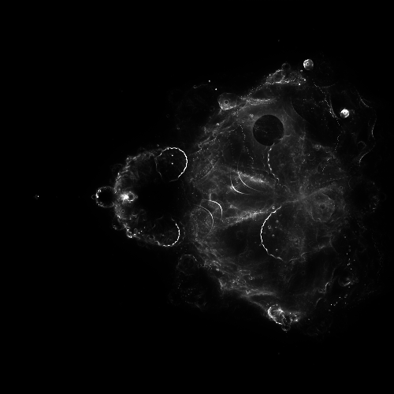

# bbrot

**bbrot** is a CLI [Buddhabrot](https://en.wikipedia.org/wiki/Buddhabrot) renderer.

It's currently very basic; it has minimal options and only supports rendering to a png file.

### Sample output



That took about 10 seconds to render.

### Usage

To build the executable, run the following command in this directory using Rust nightly

```
cargo build --release
```

The executable can then be found inside `target/release`. You can then run the executable with the `-h` flag for information on how to run it.
